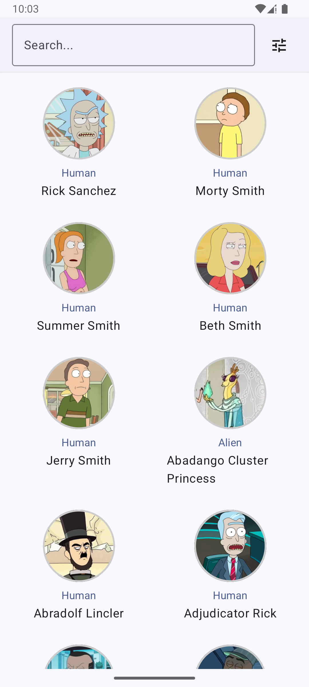
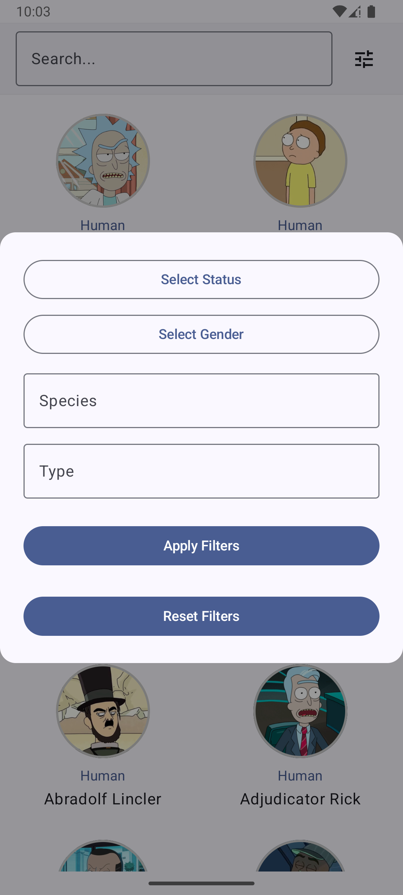
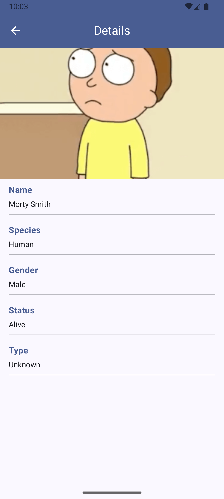

# 🧪 Simple Rick and Morty API with Jetpack Compose

A modular Kotlin Compose project that plays nice with DDD, reactive data patterns, and modern UI composition. Built for fun, not fame.

## 📸 Screenshots

| Home | Filters | Details | Splash |
|------|---------|---------|--------|
|  |  |  |  |

---

## ▶️ Run It

1. Steal a Kotlin dev's laptop. Skip to step 4.
2. Install Android Studio.
3. Open the project and sync Gradle.
4. Run the app. Enjoy the sci-fi chaos.

---

## 🏗️ Project Architecture

### 1. `application/`
Handles global concerns: input validation, routing, responsiveness, etc.

### 2. `core/` (Domain Layer – Domain Driven Design)
- `entity/` – Domain data objects.
- `mocks/` – Dummy data for testing and previews.
- `ports/` – Interfaces to be implemented by data services (hexagonal architecture).

### 3. `features/` (Self-contained units of functionality)
- `previews/` – For sanity during development.
- `state/` – ViewModels (aka state holders).
- `widgets/` – UI components specific to the feature.
- `hooks/` – React/Flutter-inspired logic observables (reactive data fetching).
- `views/` – Screens, modals, and other display units.
- `routes/` – Defines `NavHost` entry points (if needed).

### 4. `services/` (Better than repositories)
Each API is self-contained:
- Implements a `port` from `core`
- `responses/` – API response models
- `actions/` – Encapsulate each API call
- `mappers/` – JSON ↔ class conversions

### 5. `ui/`
Generic, reusable UI components (like atoms/molecules pattern).

---

## 📐 Patterns Used

- **Lazy Singleton** – For `ServicesGateway`
- **Observer / Reactive** – Hooks listen to state and react accordingly
- **Local Composition** – To hoist or share state using `CompositionLocal`

---

## 🌐 API Considerations

### 1. Apollo/GraphQL vs OkHttp3/REST
Apollo would allow selective field fetching (e.g., headers only).  
Went with REST but separated `CharacterHeader` and `Character` anyway.

### 2. Paginated Data Fetching
Pagination assumes filter-driven search.  
Manual ID-based fetching breaks under filters (API returns non-contiguous IDs).

### 3. Infinite Scroll
Basic implementation: loads more when user scrolls near the bottom.  
No fancy optimizations (like capped scroll lists, index-tracking, or bidirectional awareness).

### 4. Data Caching
Not implemented (intentionally).  
In a real app, you'd cache requests by params → JSON response pairs.

---

## 🧪 Testing

- A single unit test verifies JSON → entity conversion (because... priorities).

---

